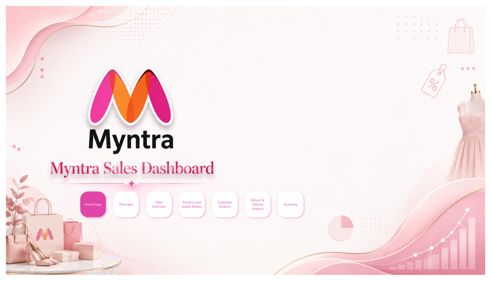
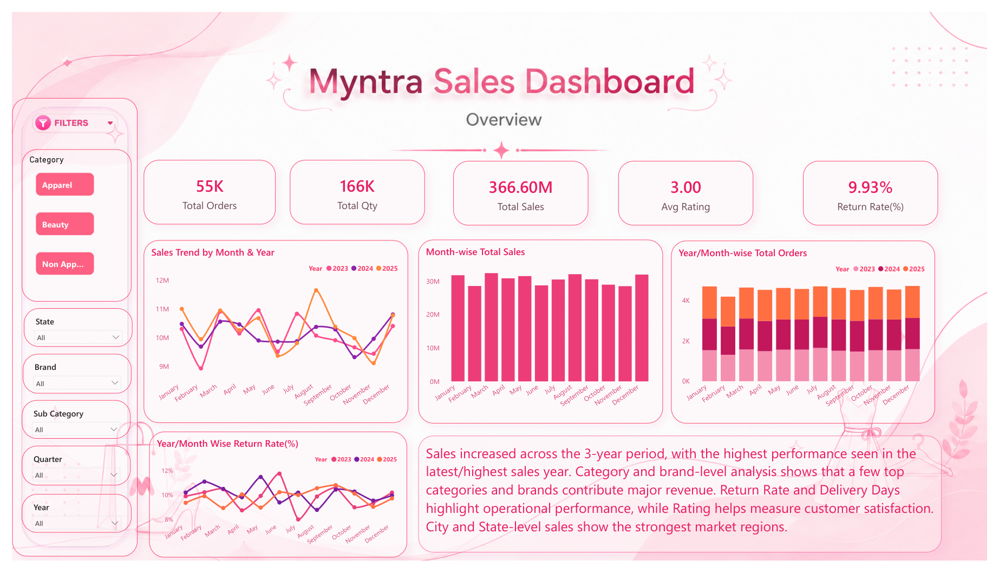
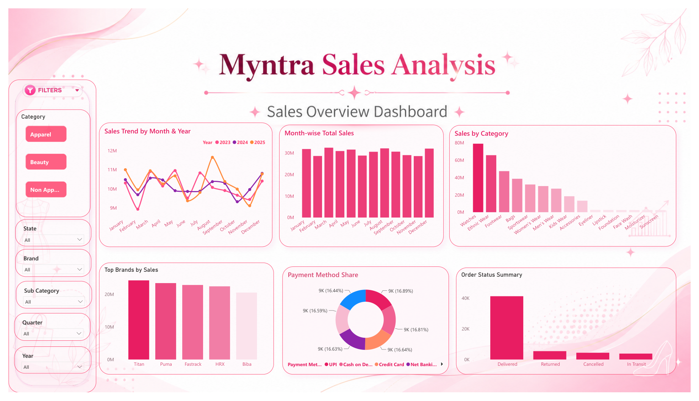
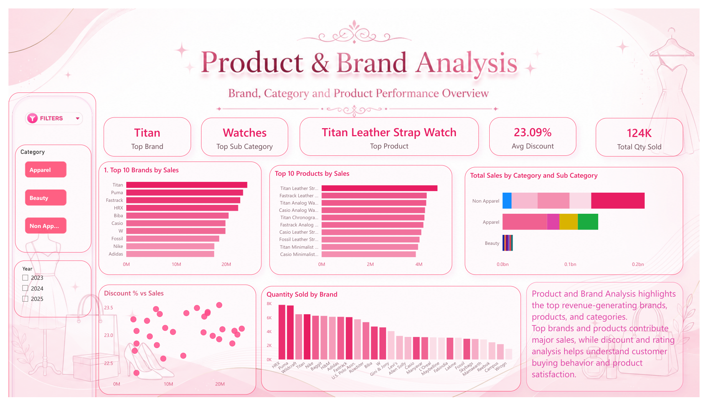
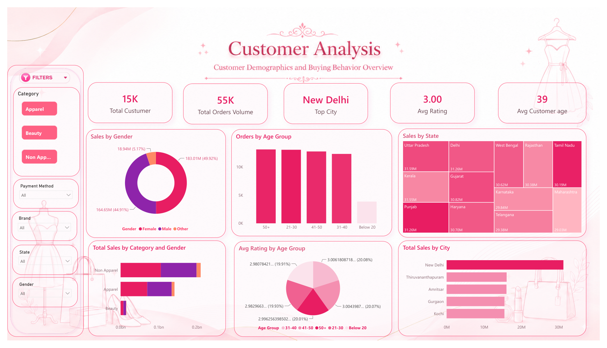
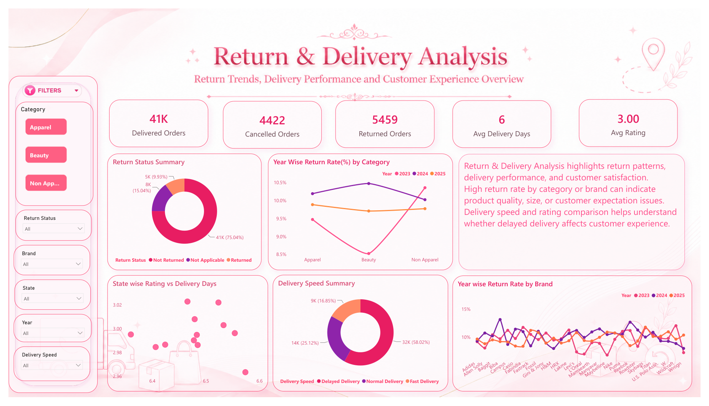
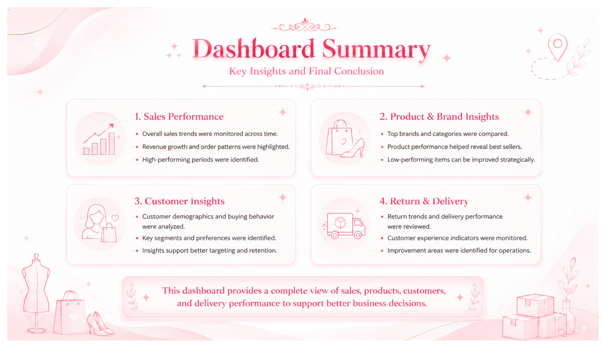

# Myntra Sales Dashboard — Power BI

<p align="center">
  
</p>

<p align="center">
  
  
  
  
</p>

## Project Overview

The **Myntra Sales Dashboard** is an interactive Power BI project designed to provide a complete view of sales performance, product and brand contribution, customer behaviour, returns, and delivery operations across **2023–2025**.

The report converts transactional data into decision-ready insights through KPI cards, trend analysis, category and brand comparisons, customer segmentation, geographic analysis, and operational performance tracking.

## Business Objectives

- Monitor sales, orders, quantity, ratings, and return performance.
- Identify top-performing brands, products, categories, cities, and states.
- Understand customer demographics and purchasing behaviour.
- Evaluate return patterns and delivery efficiency.
- Support data-driven decisions for merchandising, marketing, and operations.

## Dashboard Preview

### Executive Overview

<p align="center">
  
</p>

### Analysis Pages

| Sales Analysis | Product & Brand Analysis |
|---|---|
|  |  |

| Customer Analysis | Return & Delivery Analysis |
|---|---|
|  |  |

## Headline KPIs

| Metric | Value |
|---|---:|
| Total Sales | **366.60M** |
| Total Orders | **55K** |
| Total Quantity | **166K** |
| Total Customers | **15K** |
| Average Rating | **3.00** |
| Return Rate | **9.93%** |
| Delivered Orders | **41K** |
| Returned Orders | **5,459** |
| Cancelled Orders | **4,422** |
| Average Delivery Time | **6 days** |

## Key Insights

### Sales Performance

- Monthly sales remain consistently strong across the reporting period, with visible seasonal variation.
- **Non-Apparel** contributes the largest share of category-level sales, followed by Apparel and Beauty.
- **Watches** is the leading subcategory by sales.
- Payment methods have a relatively balanced distribution, indicating diversified customer payment preferences.

### Product and Brand Performance

- **Titan** is the top-performing brand.
- **Titan Leather Strap Watch** is the leading product.
- Other high-performing brands include **Puma, Fastrack, HRX, and Biba**.
- The average discount is **23.09%**, offering a useful benchmark for analysing the relationship between discounting and revenue.
- Total quantity sold on the product-analysis page is **124K**.

### Customer Insights

- The dashboard covers approximately **15K customers** with an average age of **39**.
- **New Delhi** is the top-performing city.
- **Uttar Pradesh** records the highest state-level sales at approximately **31.59M**.
- Female customers contribute **183.01M (49.92%)** of sales, followed by male customers at **164.65M (44.91%)**.
- The **50+**, **21–30**, **41–50**, and **31–40** groups show comparatively strong order volumes.

### Returns and Delivery

- The overall return rate is **9.93%**.
- Approximately **75.04%** of orders are marked as not returned/delivered successfully in the return-status view.
- **Normal delivery** represents the largest delivery-speed segment at **32K (58.02%)**.
- Delayed delivery accounts for **14K (25.12%)**, while fast delivery represents **9K (16.85%)**.
- Comparing return rates by brand and category helps highlight possible product-quality, sizing, or expectation gaps.

## Report Pages

1. **Home Page** — navigation hub for the complete report.
2. **Overview** — executive KPIs, monthly trends, orders, and return-rate movement.
3. **Sales Analysis** — category, brand, payment-method, and order-status performance.
4. **Product & Brand Analysis** — top brands, products, subcategories, discounts, and quantity sold.
5. **Customer Analysis** — gender, age group, city, state, ratings, and category preferences.
6. **Return & Delivery Analysis** — return status, delivery speed, delivery days, and brand/category return rates.
7. **Dashboard Summary** — consolidated findings and business conclusions.

## Interactive Filters

The report includes slicers for:

- Category
- Subcategory
- Brand
- State
- City or geography-related views
- Quarter
- Year
- Gender
- Payment method
- Return status
- Delivery speed

## Tools and Skills Demonstrated

- Microsoft Power BI Desktop
- Dashboard design and visual storytelling
- KPI development and performance tracking
- Data modelling and measure creation
- Time-series and trend analysis
- Customer segmentation
- Product, brand, and category analysis
- Geographic sales analysis
- Return and delivery performance analysis
- Interactive filtering and report navigation

## Repository Structure

```text
myntra-sales-dashboard/
├── README.md
├── assets/
│   ├── home-page.png
│   ├── dashboard-overview.png
│   ├── sales-analysis.png
│   ├── product-brand-analysis.png
│   ├── customer-analysis.png
│   ├── return-delivery-analysis.png
│   └── dashboard-summary.png
└── docs/
    └── Myntra_Sales_Dashboard.pdf
```

> Add your `.pbix` file and source dataset to the repository only when you have permission to share them.

## How to Explore the Project

1. Review the dashboard screenshots in the `assets` folder.
2. Open the complete report from [`docs/Myntra_Sales_Dashboard.pdf`](docs/Myntra_Sales_Dashboard.pdf).
3. Add the Power BI `.pbix` file to the repository for an interactive local experience.
4. Open the file in Power BI Desktop and use the slicers to explore different segments and periods.

## Potential Enhancements

- Add year-over-year and month-over-month growth KPIs.
- Include profit, margin, and customer-retention analysis when those fields are available.
- Add drill-through pages for individual brands, products, and customers.
- Create tooltip pages for richer contextual analysis.
- Publish the report to Power BI Service and add a live dashboard link.
- Add forecasting or anomaly detection for sales and returns.

## Dashboard Summary

<p align="center">
  
</p>


